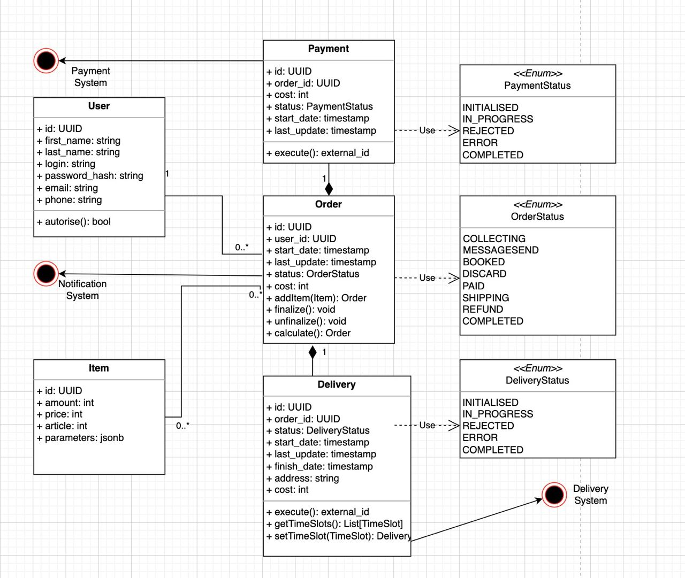
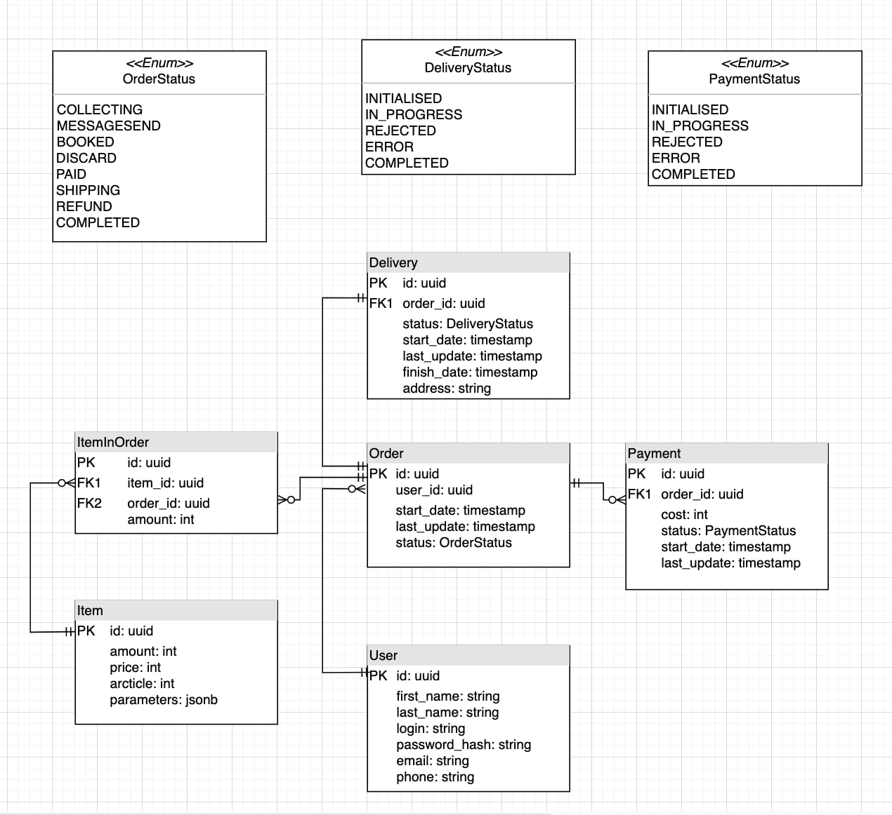

# Demo service

## Terms of reference
- Пользователь должен иметь возможность:
  * просмотреть товары
  * добавлять товары в заказ и регулировать кол-во каждого товара
  * удалять товары из заказа
  * финализировать заказ с уточнением необходимых данных
  * изменять состав заказа даже после его финализации
  * выбирать желаемое время доставки заказа
  * оплатить заказ после выбора времени доставки
  * посмотреть информацию о заказе

- Система должна уметь:
  * бронировать товары после финализации
  * отсчитывать время после начала сбора заказа(добавление в корзину)
  * высылать уведомление пользователю, если тот {некоторое время} не финализирует заказ
  * узнавать о том, что уведомление пришло пользователю
  * генерировать url, который ведет на  нефинализированный заказ пользователя
  * уметь отслеживать, был ли совершен переход по данному url
  * отсчитывать время с момента, когда уведомление с url пришло пользователю
  * отменять нефинализированный заказ, если пользователь в течение {некоторого времени} не перешел по url(при условии, что уведомление ему пришло)
  * пересчитывать стоимость заказа, в случае если он не был доставлен вовремя или если система рассчитала невозможное время
  * инициировать возврат средств пользователю, если заказ был пересчитан
  * анализировать заказ, внутренние параметры и параметры внешнего сервиса доставки и на их основе  генерировать временные слоты для доставки
  * передавать во внешнюю систему доставки информацию о заказе после его оплаты
  * оптимально выбирать аккаунт доставки
  * отсчитывать время с начала финализации заказа
  * снимать бронь на товары заказа, если он не был оплачен в течение {некоторого времени} с момента его оформления
  * предоставить возможность переоформить неоплаченный в течение {некоторого времени} заказ
  * получать от внешней системы статус произведенной оплаты

- Нефункциональные требования:
  * fault-tolerant
  * гарантировать надежность оплаты
  * оптимально выбирать аккаунт доставки
  * обеспечение конфиденциальности данных
  * логировать обращения к внешним системам
  * масштабируемость
  * Собирать необходимые метрики и логи чтобы знать состояние системы

[google doc](https://docs.google.com/document/d/1Xe-ezYNSC7euWNHHYeWzw4bjlBmWTQKCSdc8BPT4dQA)

## Schemas



## Structures
```
UserForm {
    firstName: string
    surname: string
    email: string
    login: string
    password: string
    repeatPassword: string
}
```
```
LoginForm {
    email: string
    login: string
    password: string
}
```
```
UserInfo {
    firstName: string
    surname: string
    email: string
    login: string
}
```
```
ShortProductInfo {
    id: UUID
    name: string
    price: int
    imageUrl: string
}
```
```
ProductInfo {
    id: UUID
    name: string
    price: int
    imageUrl: string
    description: string
}
```
```
ProductInOrder {
    product: ShortProductInfo
    amount: int
}
```
```
TimeSlot {
    From: string
    To: string
}
```
`OrderStatus: COLLECTING | BOOKED | DISACRD | PAID | SHIPPING | REFUND | COMPLETED`
`DeliveryStatus: INITIALIZED | IN_PROGRESS | REJECTED | ERROR | COMPLETED`
`PaymentStatus: INITIALIZED | IN_PROGRESS | REJECTED | ERROR | COMPLETED`
```
DeliveryInfo {
deliveryStatus: DeliveryStatus
address: string
timeSlot: TimeSlot
}
```
```
PaymentInfo {
    paymentStatus: PaymentStatus
    timeSlot: TimeSlot
}
```
```
OrderInfo {
    Id: uuid
    start_date: string
    last_update: string
    status: OrderStatus
    products: List[ProductInOrder]
    cost: int
    delivery: DeliveryInfo
    payment: PaymentInfo
}
```
```
ShortOrderInfo {
    id: uuid
    status: OrderStatus
    cost: int
}
```

## API


- REQUEST:
  * HTTP VERB: POST
  * URL: /sign_up/
  * BODY FORMAT: UserForm

- RESPONSE:
  * HTTP CODES:
    * 201: success
    * 400: bad request

---

- REQUEST:
  * HTTP VERB: POST
  * URL: /login/
  * BODY FORMAT: LoginForm

- RESPONSE:
  * HTTP CODES:
    * 200: success
    * 400: bad request
    * 401: unauthorized
  * BODY FORMAT: { “access”: string }


---

- REQUEST::
  * HTTP VERB: POST
  * URL: /login_by_token/
  * HEADERS:
    * Authorization: Bearer access_token


- RESPONSE:
  * HTTP CODES:
    * 200: success
    * 400: bad request
    * 401: unauthorized
  * BODY FORMAT: UserInfo


---

- REQUEST::
  * HTTP VERB: GET
  * URL: /logout/
  * HEADERS:
    * Authorization: Bearer access_token

- RESPONSE:
  * HTTP CODES:
    * 200: success
    * 401: Unauthorized


---

- REQUEST::
  * HTTP VERB: GET
  * URL: /products/

- RESPONSE:
  * HTTP CODES:
    * 200: success
  * BODY FORMAT: List[ShortProductInfo]


---

- REQUEST::
  * HTTP VERB: GET
  * URL: /products/product_id/

- RESPONSE:
  * HTTP CODES:
    * 200: success
    * 404: not found
  * BODY FORMAT: ProductInfo


---

- REQUEST::
  * HTTP VERB: POST
  * HEADERS:
    * Authorization: Bearer access_token
  * URL: /cart/product/product_id
  * BODY FORMAT: { amount: int }

- RESPONSE:
  * HTTP CODES:
    * 201: success
    * 400: bad amount
    * 401: unauthorized
    * 404: bad product_id
  * BODY FORMAT: OrderInfo


---

- REQUEST::
  * HTTP VERB: POST
  * HEADERS:
    * Authorization: Bearer access_token
  * URL: /cart/finalize


- RESPONSE:
  * HTTP CODES:
    * 200: success
    * 400: bad cart
    * 401: unauthorized
    * 410: товар нет в нужном количестве   * BODY FORMAT:{ product_id amount }
  * BODY FORMAT: { order_id}


---

- REQUEST::
  * HTTP VERB: POST
  * HEADERS:
    * Authorization: Bearer access_token
  * URL: /order/order_id/unfinalize


- RESPONSE:
  * HTTP CODES:
    * 200: success
    * 400: Bad order
    * 401: unauthorized
    * 403: Access denied
    * 404 not found


---

- REQUEST::
  * HTTP VERB: GET
  * HEADERS:
    * Authorization: Bearer access_token
  * URL: /order/order_id/time_slots


- RESPONSE:
  * HTTP CODES:
    * 200: success
    * 403: Access denied
    * 404: not found
  * BODY FORMAT: List[TimeSlot]


---

- REQUEST::
  * HTTP VERB: POST
  * HEADERS:
    * Authorization: Bearer access_token
  * URL: /order/order_id/time_slots
  * BODY FORMAT: TimeSlot


- RESPONSE:
  * HTTP CODES:
    * 200: success
    * 400: slot is already assigned
    * 401: unauthorized
    * 403: Access denied
    * 404 not found


---

- REQUEST::
  * HTTP VERB: PUT
  * HEADERS:
    * Authorization: Bearer access_token
  * URL: /order/order_id/
  * BODY FORMAT: OrderInfo


- RESPONSE:
  * HTTP CODES:
    * 200: success
    * 401: unauthorized
    * 403: Access denied
    * 404 order not found


---

- REQUEST::
  * HTTP VERB: POST
  * HEADERS:
    * Authorization: Bearer access_token
  * URL: /order/order_id/pay


- RESPONSE:
  * HTTP CODES:
    * 302: success, redirect to pay service
    * 401: unauthorized
    * 403: Access denied
    * 404 order not found


---

- REQUEST::
  * HTTP VERB: GET
  * HEADERS:
    * Authorization: Bearer access_token
  * URL: /order/order_id


- RESPONSE:
  * HTTP CODES:
    * 200: success
    * 401: unauthorized
    * 403: Access denied
    * 404 order not found
  * BODY FORMAT: OrderInfo


---

- REQUEST::
  * HTTP VERB: GET
  * HEADERS:
    * Authorization: Bearer access_token
  * URL: /order/


- RESPONSE:
  * HTTP CODES:
    * 200: success
    * 401: unauthorized
    * 403: Access denied
    * 404 order not found
  * BODY FORMAT: List[ShortOrderInfo]


## Ubiquitous language


## Bounded contexts


* Учет продуктов

Product - артикул продукта интернет магазина. Обладает собственными характеристиками parameters, названием артикула name, ценой за единицу товара price, количеством на складе на данный момент amount. Также обладает информацией, полезной для потенциального покупателя: описанием description и ссылкой на картинку товара imageUrl.


Резервирование продукта - при финализации заказа на конкретного пользователя резервируется определенное количество продуктов по артикулу (name). Зарезервированные продукты пропадают из витрины других пользователей.

Витрина - список товаров, которые пользователь может добавить в свою корзину.

* Составление заказа

Cart - нефинализированный заказ в состоянии COLLECTING, “корзина”. В корзине пользователь может добавлять продукты product, изменять количество продукта в корзине amount, удалять продукты.

Order - заказ пользователя. Имеет следующие состояния и соответствующие особенности:
COLLECTING - заказ не финализирован, в состоянии “корзины”. Пользователь может редактировать содержимое корзины, продукты за ним не резервируются.
MESSAGESEND - пользователь что-то положил в корзину, и покинул магазин. Через некоторое время ему по контактным данным высылается сообщение с предложением продолжить собирать корзину/финализировать заказ. Этот статус сообщает о том, что это уведомление было отправлено.
BOOKED - заказ финализирован, продукты резервируются за пользователем (см. контекст учета продуктов).
DISCARD - заказ отменен.
PAID - заказ оплачен.
SHIPPING - внешний сервис доставки принял заказ.
REFUND - допущена ошибка при доставке заказа (привезли не вовремя, не привезли и т.д), пользователю высылается часть от внесенной суммы заказа.
COMPLETED - заказ завершен.

Брошенный заказ -  заказ, который перешел в статус DISCARD автоматически, т.к. пользователь не изменял его и не финализировал его некоторое время. На посланное сообщение (статус заказа MESSAGESEND) не отреагировал.

Финализация заказа - перевод пользователем заказа из состояния COLLECTING в BOOKED. При финализации продукты из корзины в указанном количестве резервируются на складе (см. контекст учета продуктов). Только после финализации заказ может быть оплачен и доставлен.

* Доставка

Delivery - доставка заказа, осуществляемая внешней компанией. На основании предоставленных этой компанией данных и внутренних параметров магазина, формируются TimeSlots
TimeSlots - временные слоты, которые пользователь может выбрать для доставки.

* Оплата
Payment - оплата заказа, осуществляется внешней компанией.

Delivery и Payment - операции, делегируемые внешним сервисам. Для мониторинга состояния операций, они обладают набором статусов:
INITIALISED - создана
IN_PROGRESS - в процессе исполнения внешним сервисом
REJECTED - отказано внешним сервисом
ERROR - произошла ошибка на стороне внешнего сервиса
COMPLETED - выполнена


* Авторизация/регистрация пользователя

User - пользователь магазина. Обладает контактными данными (name, surname, phone, email)


### Entities:

Order
User
Product
Delivery
Payment


### Value objects:


OrderStatus - статус заказа, enum: COLLECTING, MESSAGESEND, BOOKED, DISCARD, PAID, SHIPPING, REFUND, COMPLETED

DeliveryStatus - статус доставки, enum: …

PaymentStatus - статус оплаты, enum: …
Мб объединить DeliveryStatus и PaymentStatus в ExternalSystemOperationStatus, если они одинаковые

Phone - номер телефона

Email - адрес электронной почты

UserName - используется для firstname и lastname у User’а

Address - адрес, включает в себя город, улицу, номер дома и квартиры


### Aggregates:

Order-ItemInOrder-ItemToQuantity-Delivery-Payment
User
Item


### Events:


Товар добавлен в корзину
ProductAddedToOrder(order_id, product_id, amount)

Товар удален из корзины
ProductDeletedFromOrder(order_id,product_id)

Заказ Финализирован
OrderFinalized(order_id,user_id, cost, ProductsInOrder:(product_id, amount))

Пользователь создан
UserCreated(user_id, name, username, email, phone)


Пользователь изменен
UserUpdated(user_id, name, username, email, phone)


Пользователь удален
UserDeleted(user_id)

Заказ отменен
OrderDiscarded(order_id, reason:string, new_order_id)


Оплата прошла успешно
PaymentSuccess(order_id, payment_id)


Оплата завершилась с ошибкой
PaymentFailed(order_id, payment_id)

Заказ оплачен
OrderPaid(order_id)

Заказ доставляется
OrderShipping(order_id)

Возврат средств
OrderRefundAfterShipping(order_id)

Возврат средств если доставка неудачна или не вовремя
OrderRefundAfterPaid(order_id)
Инициирована оплата
PaidStarted(user_id, order_id, payment_id)

Товар создан
ProductCreated(product_id, description, name, attributes{}, amount)

Товар изменен
ProductUpdated(product_id, description, name, attributes{}, amount)

Товар удален
ProductDeleted(product_id)


### Commands:

Добавить товар в корзину:
addProduct(order_id, product_id,amount)


Убрать товар из корзины:
removeProduct(order_id, product_id)

Финализировать заказ:
finalize_order(order_id)

Инициировать оплату
initializePayment(order_id, user_id, cost)

Выбрать слот для доставки
chooseSlot(slot_id)

Создать пользователя
signUp(name, surname, username, phone, email)


Залогиниться
login(email, password)
login(username, password)
loginByToken(token)


## Launch notes
* Create template repository with the name `GROUP-ID`-`YOUR-APP-NAME` and select this organization as an account
* Rename `name`, `description`, `github` to corresponding values in `pom.xml`
* Rename `postgres-app` to `postgres-YOUR-APP-NAME`, `image` to `ghcr.io/USERNAME/REPOSITORY` in `docker-compose.yml`
* Configure settings.xml
  * 
    * First option: settings in local maven repository (`~/.m2/settings.xml`)
    * Second option: settings in project root
  * Settings can be specified using:
    * mvn -s settings.xml
    * IDEA: Maven settings -> User settings file
  * Settings must contain dummy mirror to override default blocking mirror that blocks http
  ```
  <mirrors>
    <mirror>
      <id>maven-default-http-blocker</id>
      <mirrorOf>dummy</mirrorOf>
      <name>Dummy mirror</name>
      <url>http://0.0.0.0/</url>
    </mirror>
  </mirrors>
  ```

* For local app launch, use **dev** profile. It uses in-memory database
* For production deploy, run app with no profile
* Your app docker image will be automatically built and available at `ghcr.io/username/repository` 
* You can override app version using environment variable `APP_VERSION`, e.g. `APP_VERSION=0.1.0-SNAPSHOT docker compose up -d`
* To run project on shared instance do `cp docker-compose.override.example.yml docker-compose.override.yml`. It will join the infra network with Logstash, etc

## API

### Authentication module

- **POST /authentication**: Authenticate
- **POST /authentication/refresh**: Refresh authentication

### User module

- **POST /users**: Register
- **POST /authentication**: Authenticate
- **POST /authentication/refresh**: Refresh authentication
- **GET /users/me**: Get information about current user
- **DELETE /users/me**: Delete current user

### Task module

- **POST /tasks**: Create task
- **GET /tasks**: Get all tasks
- **GET /tasks/{id}**: Get task
- **POST /tasks/{id}/assignee/{username}**: Assign task
- **DELETE /tasks/{id}**: Delete task

### OpenAPI
* **GET /swagger-ui.html**: Swagger UI
  * Paste bearer token to Authorize window to have access to secured endpoints

## Synchronous calls (through interfaces)

`AuthService.authenticate` -> `UserService.getUser(username)`

## Authentication

**Authenticate**

Request:

POST /authentication

```json
{
    "username": "<username>",
    "password": "<password>"
}
```

Response:

```json
{
    "accessToken": "<token>",
    "refreshToken": "<token>"
}
```

Access token should be used in all other requests as header:
`Authorization: Bearer <access token>`

**Refresh authentication**

Request:

POST /authentication/refresh

As an auth token refresh token should be used in request header: `Authorization: Bearer <refresh token>`


## Messaging

### User module

Output events:

- **USER_CREATED**
- **USER_DELETED**


### Task module

Input events:

- **USER_DELETED** - Remove all tasks created by deleted user,
remove assignee from tasks assigned to him

Output events:

- **TASK_CREATED**
- **TASK_DELETED**
- **TASK_ASSIGNED**

### Notification module

Input events:

- **USER_CREATED** - send greeting e-mail
- **TASK_ASSIGNED** - Notify user

[//]: # ()
[//]: # (```plantuml:messaging)

[//]: # (@startuml)

[//]: # (node UserModule)

[//]: # (node TaskModule)

[//]: # (node NotificationModule)

[//]: # ()
[//]: # ('UserModule outputs)

[//]: # (UserModule --> USER_CREATED)

[//]: # (UserModule --> USER_DELETED)

[//]: # ()
[//]: # ('TaskModule inputs)

[//]: # (USER_DELETED --> TaskModule: Remove all tasks created by deleted user,\n \)

[//]: # (remove assignee from tasks assigned to him)

[//]: # ('TaskModule outputs)

[//]: # (TaskModule --> TASK_CREATED)

[//]: # (TaskModule --> TASK_DELETED)

[//]: # (TaskModule --> TASK_ASSIGNED)

[//]: # ()
[//]: # ('NotificationModule inputs)

[//]: # (USER_CREATED --> NotificationModule: Send greeting e-mail)

[//]: # (TASK_ASSIGNED --> NotificationModule: Notify user)

[//]: # ()
[//]: # ()
[//]: # (@enduml)

[//]: # (```)

[//]: # (![messaging]&#40;./docs/messaging.svg&#41;)


## Entity-relationship model

[//]: # ()
[//]: # (```plantuml:entities)

[//]: # (@startuml entities)

[//]: # (entity User {)

[//]: # (    username: text)

[//]: # (    --)

[//]: # (    * name: text)

[//]: # (    * surname: text)

[//]: # (    * email: string)

[//]: # (})

[//]: # ()
[//]: # (entity Task {)

[//]: # (    id: UUID &#40;generated&#41;)

[//]: # (    --)

[//]: # (    *author: User)

[//]: # (    assignee: User)

[//]: # (    *title: text)

[//]: # (    description: text)

[//]: # (    *status: Status)

[//]: # (})

[//]: # ()
[//]: # (enum Status {)

[//]: # (    TODO)

[//]: # (    IN_PROCESS)

[//]: # (    DONE)

[//]: # (})

[//]: # ()
[//]: # (Task::author }o..|| User::username)

[//]: # (Task::assignee }o..o| User::username)

[//]: # (Task::status }o--|| Status)

[//]: # (@enduml)

[//]: # (```)

[//]: # ()
[//]: # (![entities]&#40;./docs/entities.svg&#41;)

## Project structure

### Packages

Any module should be divided into `api` & `impl` base packages 
to define classes that can be used in other modules.

* users
  * api
    * controller
    * messaging
    * model
    * service
  * impl
    * entity
    * repository
    * service
* auth
  * api
    * controller
    * service
    * model
  * impl
    * config
    * service
* tasks
  * api
    * controller
    * messaging
    * service
  * impl
    * entity
    * repository
    * service
* notifications
  * api
    * controller
    * messaging
    * model
    * service
  * impl
    * config
    * entity
    * repository
